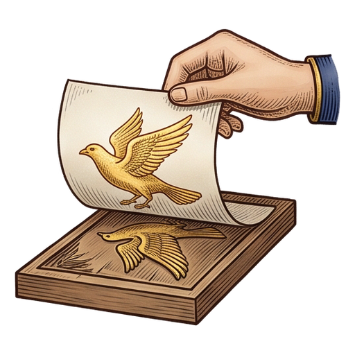

# Logospell

  

  <strong>Your AI agent's art department.</strong> 
  One MCP call returns a cohesive image set, a transparent-background set, or a single illustration, ready to drop into whatever you're building.

## Tools

### `generate_image_set`

A cohesive set of images on a solid background. One call made all
eight below:

<table>
  <tr>
    <td colspan="8"><em>Style: layered cut-paper kirigami illustration, each subject built from stacked hand-cut cardstock layers in bright saturated colors with crisp paper edges and gentle dimensional depth between the layers</em> <em>Images: an ornate hot air balloon with a wicker basket, a vintage biplane with double wings, a rigid zeppelin airship, a helicopter with a top rotor, a whimsical retro rocket with fins, an open parachute with harness lines, a hang glider with a triangular wing, a diamond kite with a ribbon tail</em> <em>Background: #FFFFFF</em></td>
  </tr>
  <tr>
    <td></td>
    <td></td>
    <td></td>
    <td></td>
    <td></td>
    <td></td>
    <td></td>
    <td></td>
  </tr>
</table>

### `generate_transparent_image_set`

A cohesive set of images with transparent backgrounds, ready to drop
onto any backdrop:

<table>
  <tr>
    <td colspan="8"><em>Style: Venetian millefiori glass mosaic: subjects assembled from tightly packed slices of glass cane, each disc bearing its own tiny star, rosette, or concentric ring pattern, in luminous ruby, cobalt, amber, jade, and violet, glassy polished sheen, fine dark seams between the discs</em> <em>Images: a tortoise with a domed shell, a fox with a sweeping tail, a koi fish mid-leap, a dragonfly with double wings, a toucan with an oversized beak, a rabbit sitting upright with ears tall, a cactus in a patterned pot, a mermaid with a curled tail</em></td>
  </tr>
  <tr>
    <td></td>
    <td></td>
    <td></td>
    <td></td>
    <td></td>
    <td></td>
    <td></td>
    <td></td>
  </tr>
</table>

### `generate_illustration`

One composed picture, in a wide range of sizes and aspect ratios:

<table>
  <tr>
    <td><em>Prompt: A small brass-and-glass airship moored to a clifftop lighthouse at sunset: the keeper waves from the railed gallery, gulls wheel overhead, and warm amber light spills across a calm sea far below. Painterly storybook illustration, rich and detailed, luminous golden-hour palette</em> <em>Resolution: 1024x1024</em></td>
  </tr>
  <tr>
    <td align="center"></td>
  </tr>
</table>

### `check_credits`

Check how many generation credits remain on your API key. Free.

### `list_recent_generations`

List your recent generations and get their download URLs again, for
example to recover a result lost to a dropped connection. Free.

## Setup

1. Sign up at [logospell.com](https://logospell.com): free starter
   credits, no card required.
2. Copy the API key from your account page.
3. Set `LOGOSPELL_API_KEY` in your environment.

## Network and credentials

This plugin talks only to `mcp.logospell.com`: the MCP endpoint
(`https://mcp.logospell.com/mcp`) plus the short-lived download URLs
its results return on the same host. It authenticates with your
`LOGOSPELL_API_KEY` as a bearer token, sent only there. No third-party
endpoints, no client-side telemetry; service calls are recorded
server-side as described in the privacy policy.

Docs: https://logospell.com/docs · Privacy: https://logospell.com/privacy · Support: contact@logospell.com
