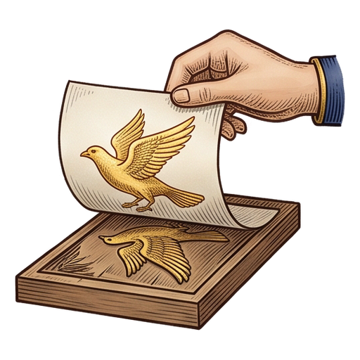

# Logospell

  

<h3 align="center">Your AI agent's art department.</h3>

One MCP call returns a cohesive image set, a transparent-background set, or a single illustration, ready to drop into whatever you're building.

## Tools

### `generate_image_set`

A cohesive set of images on a solid background. One call made all
nine below:

<table>
  <tr>
    <td colspan="9"><em>Style: Hand-bent neon sign illustration with vivid glowing glass tubes and tight warm halation</em>  <em>Subjects: a steaming coffee cup, a tilted cocktail glass, a bowling pin, a jukebox, a milkshake with a straw, a curving arrow sign, a movie ticket, a retro rocket, a shooting star</em>  <em>Background: #16182A</em></td>
  </tr>
  <tr>
    <td></td>
    <td></td>
    <td></td>
    <td></td>
    <td></td>
    <td></td>
    <td></td>
    <td></td>
    <td></td>
  </tr>
</table>

### `generate_transparent_image_set`

A cohesive set of images with transparent backgrounds, ready to drop
onto any backdrop:

<table>
  <tr>
    <td colspan="8"><em>Style: Venetian millefiori glass mosaic: subjects assembled from tightly packed slices of glass cane, each disc bearing its own tiny star, rosette, or concentric ring pattern, in luminous ruby, cobalt, amber, jade, and violet, glassy polished sheen, fine dark seams between the discs</em>  <em>Subjects: a tortoise with a domed shell, a fox with a sweeping tail, a koi fish mid-leap, a dragonfly with double wings, a toucan with an oversized beak, a rabbit sitting upright with ears tall, a cactus in a patterned pot, a mermaid with a curled tail</em></td>
  </tr>
  <tr>
    <td></td>
    <td></td>
    <td></td>
    <td></td>
    <td></td>
    <td></td>
    <td></td>
    <td></td>
  </tr>
</table>

### `generate_illustration`

One composed picture, in a wide range of sizes and aspect ratios:

<table>
  <tr>
    <td><em>Prompt: A small brass-and-glass airship moored to a clifftop lighthouse at sunset: the keeper waves from the railed gallery, gulls wheel overhead, and warm amber light spills across a calm sea far below. Painterly storybook illustration, rich and detailed, luminous golden-hour palette</em>  <em>Resolution: 1024x1024</em></td>
  </tr>
  <tr>
    <td align="center"></td>
  </tr>
</table>

### `create_reference`

Create an upload slot for a style reference image: you get back a
ref_ token and a one-line curl upload command. Both set tools accept
up to 3 tokens via styleReferences; alone or alongside the style
text, the references define the style by example, the tightest way
to extend an existing set in its original look. Free.

### `check_credits`

Check how many image generation credits remain on your account: one
balance shared by your MCP calls and the logospell.com generate page.
Free.

### `list_recent_generations`

List your recent generations and get their download URLs again, for
example to recover a result lost to a dropped connection. Generations
made on the generate page at logospell.com appear here too. Free.

### `edit_image_set`

Free. Change how an existing image set is delivered without generating again: `width` and `height` (both, one, or neither, as on the set tools), `canvas` (with no size fixed: `uniform` for one canvas across the set, `subject` to wrap each image around its own subject), `minimumMargin`, `sizing` (relative or fill), `format` and `quality`, and for a transparent set `background` (a `#RRGGBB` color to compose over, or `"transparent"`). Takes the set's `generation` id; a lever left out keeps its current value. The set's download is replaced in place, so the same URL serves the new delivery. Style, subjects and references cannot be edited.

### `export_icons`

Free. Export an existing image set as icons for the web, iOS, Android and Flutter at the base size `iconSize` you name (an even number, 16 to 256; it sizes the batch, so every icon is the delivered image scaled and no file exceeds it): every subject at every density each platform needs, laid out as each expects, with a viewer and a ledger that says per tree whether any file has some blur. One batch and one size per call; `format` and `quality` default to the set's current ones.

## Setup

1. Sign up at [logospell.com](https://logospell.com): free starter
   credits, no card required.
2. Copy the API key from your account page.
3. Set `LOGOSPELL_API_KEY` in your environment.

## Network and credentials

This plugin talks only to `mcp.logospell.com`: the MCP endpoint
(`https://mcp.logospell.com/mcp`) plus the short-lived download URLs
its results return on the same host. It authenticates with your
`LOGOSPELL_API_KEY` as a bearer token, sent only there. No third-party
endpoints, no client-side telemetry; service calls are recorded
server-side as described in the privacy policy.

Docs: https://logospell.com/docs · Privacy: https://logospell.com/privacy · Support: contact@logospell.com
